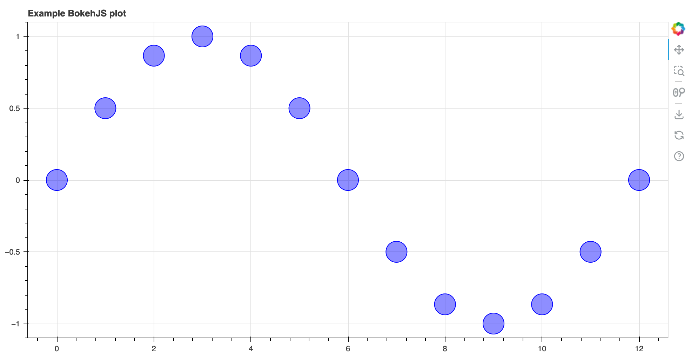

# BokehJS Examples

## Introduction

Examples using BokehJS as a standalone library without Python.

Currently contains examples of integrating BokehJS with TypeScript frameworks and build tools,
other possibilities to follow later.

Here is an example of TypeScript code to produce a BokehJS plot:

```ts
import * as Bokeh from "@bokeh/bokehjs";

function create_bokehjs_plot(): Bokeh.Plotting.Figure {
  // Create figure
  const plot = Bokeh.Plotting.figure({
    title: "Example BokehJS plot", height: 500, sizing_mode: "stretch_width"
  });

  // Calculate x, y value of sine curve
  const x = [0, 1, 2, 3, 4, 5, 6, 7, 8, 9, 10, 11, 12];
  const y = x.map(x => Math.sin(Math.PI*x/6));

  // Plot circles
  plot.scatter(x, y, {color: "blue", size: 30, fill_alpha: 0.4});

  return plot;
}

// Render plot in <div>
Bokeh.Plotting.show(create_bokehjs_plot(), "#target");
```

and an image of the generated plot:



## Contents

### Examples

The examples are located in the top-level `typescript` directory. The following combinations of
frameworks and build tools are included:

Directory | Framework | Build tool
--- | --- | ---
angular_ng | [Angular](https://angular.dev/) | [ng](https://angular.dev/cli/build)
react_vite | [React](https://react.dev/) | [Vite](https://vite.dev/)
vanilla_rspack | None | [Rspack](https://rspack.dev/)
vanilla_vite | None | [Vite](https://vite.dev/)
vanilla_webpack | None | [Webpack](https://webpack.js.org/)
vue_vite | [Vue](https://vuejs.org/) | [Vite](https://vite.dev/)

Each directory contains a `README.md` that describes the steps to follow to create a simple BokehJS
example using that combination of framework and build tool. There is also a subdirectory called
`created` that contains the files generated by following the steps in the `README.md`.
The easiest way to try out an example is to clone this repository, `cd` to the appropriate `created`
directory and build the example using `npm` commands from the `package.json` in the usual manner.

### Recipes

Each example is created from a recipe located in the `recipes` directory. Each recipe is a
TypeScript class that can be used to generate both a human-readable `README.md` file and a `bash`
script that can be used to automatically create the example. See `recipes/README.md` for more
information.

### Testing

All recipes are automatically recreated and tested once a week and whenever a PR is submitted to
this repository. The code for this is contained in the `ci` directory. The `bash` scripts to create
examples are in the `ci/typescript` directory; these can be individually run to create and build a
single example. The `ci/tests` directory contains the [Playwright](https://playwright.dev/) test
code and comparison images used in CI. For further details see the scripts in the `ci` directory
and the github action workflows in `.github/workflows/test.yml`.

## Limitations

Currently these examples cannot be built using a release NPM package of BokehJS as changes are
required which will not be released until BokehJS 4.0.
In the meantime the examples work using an NPM package produced using a particular Bokeh branch
which can be checked out and built in a temporary directory and the resultant NPM package copied
across to the root directory of this repository as follows. Note you will need `git` and `node`
installed.

```bash
cd <directory of choice>
git clone -b ianthomas23/13732_maybe_initialize --single-branch --depth 1 https://github.com/bokeh/bokeh.git
cd bokeh/bokehjs
node make build
npm pack
```

This will produce the file `bokeh-bokehjs-3.8.0-dev.1.tgz` which should be copied to the root
directory of your `bokehjs-examples` repository.

When Bokeh and BokehJS 4.0 are released, these instructions and the code within this repository
will be updated to reflect the simpler installation process.
